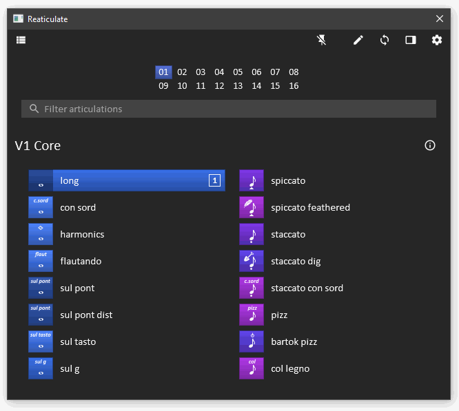

# Introduction

rtk (**R**EAPER **T**ool**k**it, but stylized as lowercase `rtk`) is a GUI and utility
library for [REAPER](https://www.reaper.fm/) written in Lua whose design is loosely
inspired by [GTK](https://www.gtk.org/), with some aspects borrowed from HTML and CSS.

rtk can be used in any script, but it was originally written for
[Reaticulate](https://reaticulate.com), which is shown below to serve as a demonstration
of rtk's capabilities.





The **@{tutorial}** is the best place to get started coding with rtk.

You can also visit the [project page on GitHub](https://github.com/jtackaberry/rtk) for
original source code and issue tracking.

## Download

There are a couple different methods to install rtk:

| Audience | Method | When to Use |
|-|-|-|
| User | ReaPack | You want to use a script that requires a system-wide install of rtk. The script's documentation will indicate this, or may direct you to this site when you run it. |
| Developer | ReaPack | Easiest method to get started. You don't want to have to distribute rtk (which is fairly sizable) along with your script, and you're comfortable asking your users to install the ReaPack for rtk. Ideal for quick, single-file scripts. |
| Developer | Bundle | Maximum control. You want to minimize the prerequisite steps for your script, or you want the most assurance that what you tested is what your uses will be running. |

Developers, you can learn more about these options on the @{loading|Loading rtk} page.


### 1. ReaPack

**[ReaPack](https://reapack.com/)** is a package manager for REAPER. If you don't already
have it installed, first follow ReaPack's [installation
instructions](https://reapack.com/user-guide#installation). Once installed, you can
[import](https://reapack.com/user-guide#import-repositories) the following repository:

```url
https://reapertoolkit.dev/index.xml
```

### 2. Library Bundle

While rtk's source code is comprised of many individual files, it is available as a single
bundled file.

[Download the latest release](https://reapertoolkit.dev/rtk.lua).  (Right click | Save Link As)

You can choose to distribute `rtk.lua` alongside your application, or you can also
use rtk's custom bundler to combine your script files with rtk to produce a single
script file that can be executed directly by REAPER without needing to fiddle with Lua
package paths.

Read more about this option on the @{loading|Loading rtk} page.

## Features

Some of rtk's key features are:

* support for fluid layouts -- no fixed coordinates needed (although possible if desired)
* a flexible box model that will be familiar to web developers
* Retina/high-DPI friendly, with fully scalable UI, including support for multi-resolution
  image packs that dynamically picks the best resolution for the current scale
* support for touch screens with kinetic touch-scrolling
* a rich and customizable event handling system
* enhanced window management (using the js_ReaScriptAPI extension if available)
* an animation subsystem that allows animating many different widget attributes
* support for light and dark themes, adapting to the user's REAPER theme
* a featureful logging module to improve your debugging and benchmarking experience
* comprehensive API documentation

Currently the widget set is a bit anemic but more are planned as the project matures.


## Requirements

REAPER 6 is recommended due to test coverage.  REAPER 5.975 and later is expected to work,
however the level of testing on these older versions isn't as strong as REAPER 6.

The [SWS](https://www.sws-extension.org/) and
[js_ReaScriptAPI](https://forum.cockos.com/showthread.php?t=212174) extensions are
recommended but not required.  rtk will work with either or both, and when present much
more functionality is available.  The APIs are appropriately documented when an extension
is required, and it's up to you as a script author to use or avoid these APIs, and if
necessary pass along the extension requirement(s) to your users.


## Hello World

Here's a simple example to give you a flavor of what rtk looks like:

```lua
-- Set package path to find rtk installed via ReaPack
package.path = reaper.GetResourcePath() .. '/Scripts/rtk/1/?.lua'
-- Now we can load the rtk library.
local rtk = require('rtk')

-- Create an rtk.Window object that is to be the main application window
local window = rtk.Window()
-- Create a new button initialized with this label.  Note the curly braces,
-- because all rtk.Widget classes actually receive a table of attributes
-- upon initialization.  This one is a special "positional" value that
-- corresponds to the 'label' attribute.
local button = rtk.Button{'Fool me once, shame on ... you'}
-- Add an onclick handler to respond to mouse clicks of the button
button.onclick = function(self, event)
    -- Animate the button color to red and change the label.
    button:animate{'color', dst='red'}
    button:attr('label', "Fool me--can't get fooled again!")
end
-- Add the button widget to window, centered within it.  In practice you
-- would probably use a series of box container widgets to craft a layout.
window:add(button, {halign='center', valign='center'})
-- Finally open the window.
window:open()
```

Now go check out the **@{tutorial}**.
